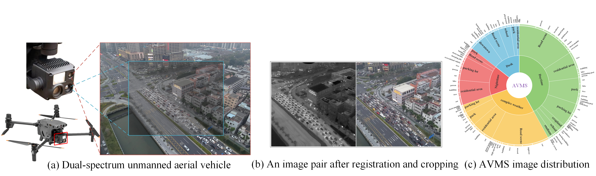

# FS-Diff: Semantic Guidance and Clarity-Aware Simultaneous Multimodal Image Fusion and Super-Resolution
<h2> <p align="center"> AVMS Dataset </p> </h2> 

---



---


### Preview

The preview of our dataset is as follows. 
---


---

### Details

- **Sensor**: DJI M30T, Its infrared camera operates within a spectral range of 8-14µm. The optical centers of the infrared and visible cameras are 3 cm apart.


- **Main scene**:
    - The aerial photography location is in Foshan, Guangdong, China.

- **Total number of image pairs**:
    - **600** (for fusion, detection, segmentation)


- **Format of images**: 
   - [Infrared] 24-bit grayscale bitmap
   - [Visible]  24-bit color bitmap

- **Image size**: **512 x 512** pixels

- **Registration**: **All image pairs are registered.** 

### Download

- [Google Drive]()
- [Baidu Yun]()

## Usage
### Environment
```python
pip install -r requirement.txt
```

### infer
```python
# run the script
python infer.py -c [config file]
```
### train
```python
# run the script
python sr.py -p train -c [config file] -enable_wandb -log_eval
```
